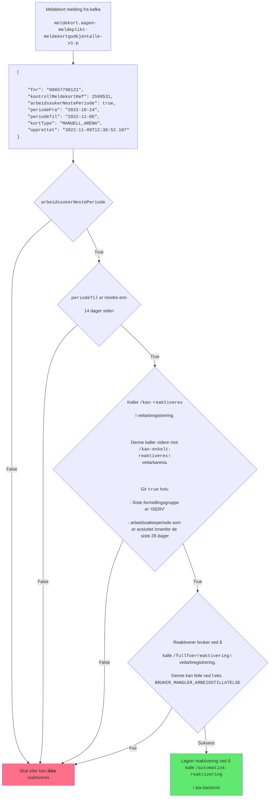

# paw-reaktiver-arbeidssoker

Reaktiverer arbeidssøkere som har blitt inaktivert, men som svarer at de fortsatt ønsker å være registrert på meldekortet.

# Teknisk flytskjema



# Utvikling

Bruk Node.js 18.

Du kan bruke [NVM](https://github.com/nvm-sh/nvm) for å sette versjon.
F.eks. `nvm install 18.15.0 && nvm use 18.15.0` eller bare `nvm use`

-   klon repo
-   installer avhengigheter: `npm i`
-   sett miljøvariabler i `.env`: `cp .env-example .env`
-   start kafka: `docker-compose up -d`
-   start mock server: `npm run mock`
-   start utviklingsserver: `npm run dev`
-   stopp kafka: `docker-compose stop && docker-compose rm -f`

## Kafka-utils

For å teste å produsere og konsumere meldinger er det laget to scripts som du kan kjøre i hvert sitt terminalvindu

-   starte produsent `./kafka-utils/produce_kafka.sh`
-   starte konsument `./kafka-utils/consume_kafka.sh`

### Eksempel på meldinger

Ved å endre på `fnr`, `periodeFra`, `periodeTil` og `opprettet` skal du kunne få testet de fleste varianter lokalt

```
{"fnr": "01020304050", "kontrollMeldekortRef": 2599531, "arbeidssokerNestePeriode": true, "periodeFra": "2022-10-24", "periodeTil": "2022-11-06" "kortType": "MANUELL_ARENA", "opprettet": "2022-11-09T12:30:52.107"}
```

## Mock

Mock serveren gir ulike resultater etter hvilket fødselsnummer du tester med

`01020304050` - ingen arbeidssøkerperioder
`50607080901` - aktiv arbeidssøkerperiode
`12345678901` - avsluttet arbeidssøkerperiode

```
curl -X POST http://localhost:3000/api/arbeidssoker/perioder\
-H 'Content-Type: application/json'\
-d '{"fnr":"50607080901"}'
```

## Deploye kun til dev

Ved å prefikse branch-navn med `dev/`, så vil branchen kun deployes i dev.

```
git checkout -b dev/<navn på branch>
```

evt. rename branch

```
git checkout <opprinnlig-branch>
git branch -m dev/<opprinnlig-branch>
```

# Henvendelser

Spørsmål knyttet til koden eller prosjektet kan stilles via issues her på github.

## For NAV-ansatte

Interne henvendelser kan sendes via Slack i kanalen [#team-paw-dev](https://nav-it.slack.com/archives/CLTFAEW75)

# Lisens

[MIT](LICENSE)
